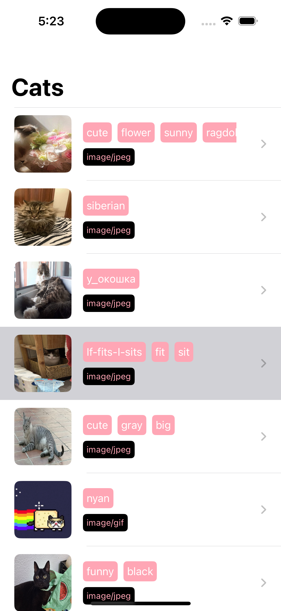
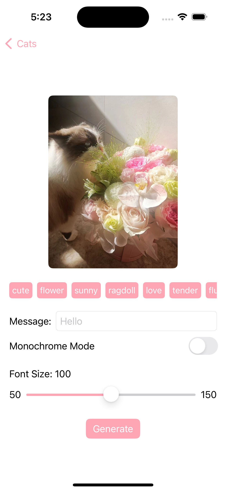
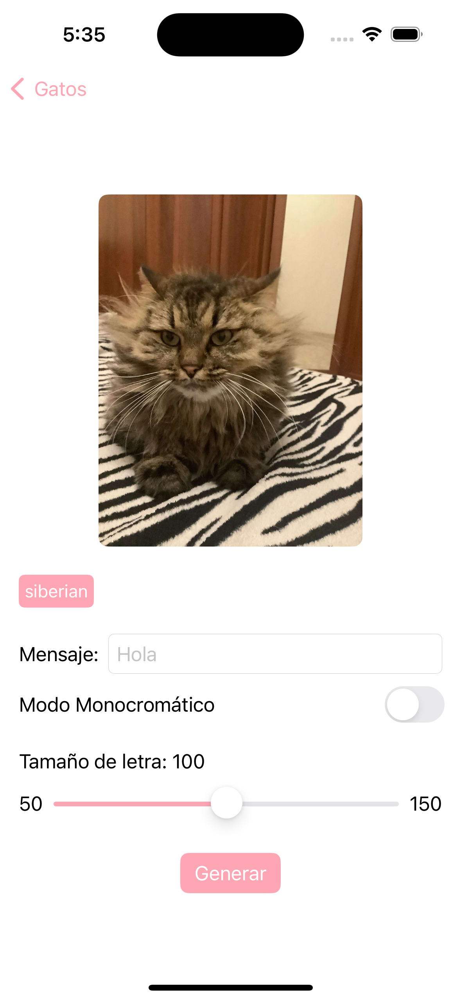
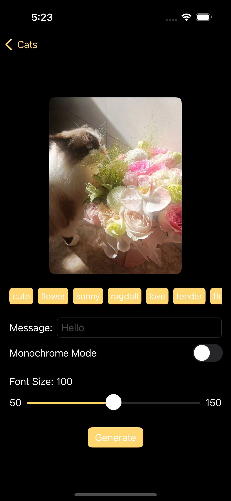

# MeowMarket
This app lists all existing Cats submitted to CATaaS API (https://cataas.com/). Users can see thumbnails of cats, tags and image details and tap on them to find out more details about each one.
Additionally, users can interact with the image generation API to modify the image and add funny text to the cats.

## Features

- **List of Cats**: Paginated list of cats and tags.

- **Details View**: Shows more details about the cats including a larger image, tags, and allows modifying the images using the API.

- **Localization**: UI element texts are localized to English and Spanish, according to device preferences.

- **App Themes**: UI elements adapt to dark and light themes.

- **Tests**: Project includes unit tests covering the majority of the code and mocking API calls.

## Stack
- MVVM
- SWIFTUI
- SwiftData
- Networking
- API Mocking
- Infinite/Paginated scroll
- API error management/recovery
- Localization

## How to Run

To run this project on your local machine, follow these steps:

1. **Clone the Repository**: First, clone this repository to your local machine using Git.

2. **Open the Project**: Open the `MeowMarket.xcodeproj` file in Xcode.

3. **Wait for SPM Dependencies**: Once the project is open in Xcode, wait for the Swift Package Manager (SPM) to fetch and build all the dependencies. This might take a few minutes.

4. **Run the Project on Simulator**: After all dependencies are resolved, select an iOS Simulator from the Xcode toolbar and click the run button to build and run the project on the simulator.

Enjoy watching Cats in the app!